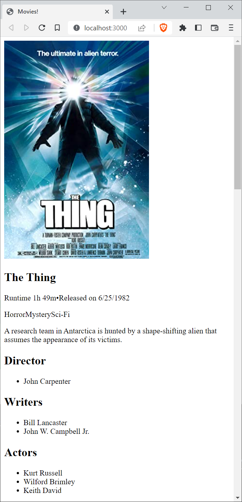
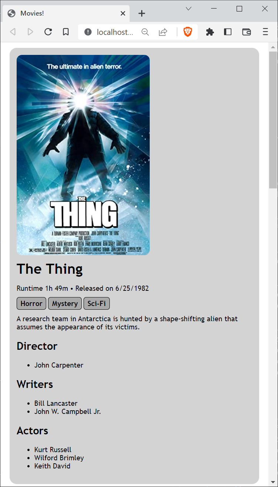

[](https://classroom.github.com/a/BBHmbKUs)
# Web Technologies - Exercise 1

This first exercise in Web Technologies consists of three parts. You will implement the first one on the server-side and the other two on the client-side. You find detailed information about these parts in the **Tasks** section below.

Before you start, you will have to set up the development environment. First and foremost, install [**Node.js**](https://nodejs.org/en/). Then, clone the repository that GitHub Classroom generated for you. Since you read this, this is most likely where you are now :).

Now configure an IDE, we recommand using [**WebStorm**](https://www.jetbrains.com/webstorm/) or [**Visual Studio Code**](https://code.visualstudio.com/). Finally, you need to install the dependencies of this project. In the project's root directory (where this <span style="font-family:Lucida Sans Typewriter">README</span> file is located), run

    npm install

The project consists of a server, which is implemented using **Node.js** and a client, which will be your favorite web browser.

To be able to access the application using a browser, you will have to start the server. To do so, you have two options. The first one is to run it using the start script:

    npm start

When using the start script, remember that you need to *restart the server whenever you make changes* to your project!

To avoid restarting the server manually each time after making a change, there is a second, **recommended** option. This option is to start the server using [`nodemon`](https://www.npmjs.com/package/nodemon). `nodemon` will not only start your server, but also monitor your code for changes you make. As a consequence, when using `nodemon`, you do not have to restart your server when making changes, which is quite helpful during development.

There is no need to install `nodemon` explicitely, it is already a development dependency of the project you cloned.

To run your server using `nodemon`, you can use the `start-nodemon` script by running

    npm run start-nodemon

Whichever option you choose, after starting the server you should see the message

    Server now listening on http://localhost:3000/

in your terminal. Visit [http://localhost:3000/](http://localhost:3000/) using your favorite Web Browser to test the application. You will see a simple message from the server displayed on the page:

    Hello world!

## Project structure

For the time being, the application consists of only one file on both sides. On the server-side, the file is `server/server.js`, on the client side, the file is `server/files/index.html`. 

First, have a look at `server/server.js`, maybe you can guess the responsibilities of the individual blocks of code. For now, there are two blocks that are of interest to you when implementing this exercise.

The first one is:

```js
    app.get('/movies', function (req, res) {
        res.send('!dlrow olleH')
    })
```

This blocks tells the server to send the string `!dlrow olleH` to a client making a `GET` request to the path `/movies`. You can check that the server is doing that by accessing [http://localhost:3000/movies](http://localhost:3000/movies). You will see the original, reversed data that the server sends. 

The second part of `server.js` of interest to you is

```js
    app.use(express.static(path.join(__dirname, 'files')));
```

This part tells the server to serve all files located in the `files` directory to a client requesting them. We are making use of so-called middleware to accomplish that. For now you do not need to understand how this works in detail, we are going to talk about middleware in future classes. The thing you need to understand is this is how we configure that the `index.html` file located in the `files` directory on the server-side is being sent to a client upon request.

Now, browse the application again by pointing a browser to [http://localhost:3000/](http://localhost:3000/) and **open the page source**. You will find the contents of `server/files/index.html`. Our middleware is working.

If you look closely near the end of the `index.html`, you will find the lines

```js
    xhr.open("GET", "/movies")
    xhr.send()
```

which are requesting the movie data from the server by making the `GET` request mentioned above. Again, you do not need to understand the details of how this works on the client-side, the only interesting part is the following line

```js
    bodyElement.append(reverseString(xhr.responseText))
```

That's were the data received from the server is added to the page. The `responseText` property of the `xhr` variable contains the content that was sent by the server - the reversed message `!dlrow olleH`. The client then uses the function `reverseString` (which you find a few lines above) to reverse the string and the `append` method of the html element of the body of the page to add the reversed message to the body. That's how the message from the server ends up on our web page when we open the application.

## Tasks
As mentioned at the beginning, this exercise consists of three parts:

1. **Part 1: Returning the movie data from the `/movies` endpoint (1 point)**  
   Implement the server-side endpoint in `server/server.js` so that `/movies` returns an array of **at least three** movie objects in **valid JSON**, based on OMDb API example data (trimmed and reformatted as specified).

2. **Part 2: Rendering the movie data on the client side (3 points)**  
   In `server/files/index.html`, parse the JSON returned by the server, loop over the movie array, and dynamically create **semantic HTML elements** that display **all** required movie information. Append the created elements to the page body.

3. **Part 3: Styling the page (2 points)**  
   Add CSS rules in the `<style>` element in the `<head>` of `server/files/index.html` to improve the look and layout of the rendered movie information (you may follow the suggested styling rules and/or extend them creatively).

### Important: Presentation Requirement

**You will be asked about your implementation during our next meeting.** Be prepared to:
- Walk through your code and explain your implementation choices
- Demonstrate the working application
- Answer questions about your approach

Make sure you understand what your code does and why you made certain decisions!

### Part 1: Returning the movie data from the /movies endpoint

In this first part of the assignment, you have to structure movie data in JSON. Choose **at least three movies** of your liking and use the **Examples** section of the [OMDb API](https://www.omdbapi.com/) to retrieve the data for these movies in JSON format.

For example, this is the data returned when searching for *The Thing*:

```json
{"Title":"The Thing","Year":"1982","Rated":"R","Released":"25 Jun 1982","Runtime":"109 min","Genre":"Horror, Mystery, Sci-Fi","Director":"John Carpenter","Writer":"Bill Lancaster, John W. Campbell Jr.","Actors":"Kurt Russell, Wilford Brimley, Keith David","Plot":"A research team in Antarctica is hunted by a shape-shifting alien that assumes the appearance of its victims.","Language":"English, Norwegian","Country":"United States, Canada","Awards":"3 nominations","Poster":"https://m.media-amazon.com/images/M/MV5BNGViZWZmM2EtNGYzZi00ZDAyLTk3ODMtNzIyZTBjN2Y1NmM1XkEyXkFqcGdeQXVyNTAyODkwOQ@@._V1_SX300.jpg","Ratings":[{"Source":"Internet Movie Database","Value":"8.2/10"},{"Source":"Rotten Tomatoes","Value":"84%"},{"Source":"Metacritic","Value":"57/100"}],"Metascore":"57","imdbRating":"8.2","imdbVotes":"430,351","imdbID":"tt0084787","Type":"movie","DVD":"14 Feb 2006","BoxOffice":"$19,629,760","Production":"N/A","Website":"N/A","Response":"True"}
```

Pick the following information from the data structure and delete the rest:

1. Title
1. Released
1. Runtime
1. Genre
1. Director
1. Writer
1. Actors
1. Plot
1. Poster
1. Metascore
1. imdbRating

You may have noticed that all properties have String values, even numerical data like *Metascore*. In the next step, do the following renaming and reformatting:

1. Rename *Genre*, *Director*, *Writer* to their plural forms to be consistent with *Actors*
1. Reformat *Released* to be in [ISO 8601](https://en.wikipedia.org/wiki/ISO_8601) format
1. Reformat *Runtime* to be an number (remove the unit **min** in the process)
1. Reformat *Genres* to be an array of genres and not a comma-separated string of genres
1. Do the same you did with *Genres* with *Directors*, *Writers*, and *Actors*, that is, convert them into an array of strings
1. Reformat *Metascore* to be a number
1. Reforamt *imdbRating* to be a number

Finally, put all the movies you chose in one JSON array and return that array instead of the `!dlrow olleH` string. To be precise, the array you return will contain three objects each of which represents the data of one movie.

**Verify your implementation by checking the `/movies` endpoint in your browser and ensuring valid JSON is returned.**

### Part 2: Rendering the movie data on the client side

In this part you will have to dynamically add new HTML elements to the `body` of the application's HTML page. Before you can use the information, you will have to find a way to parse the JSON data into JavaScript objects.

Your task is to:
1. Parse the JSON movie data received from the server into JavaScript objects
2. Loop through each movie object in the array
3. For each movie, dynamically create HTML elements that display all the movie information
4. Append these elements to the page body

**Important**: Think carefully about which HTML elements best represent the semantic meaning of your content. HTML provides many different tags, each with its own purpose and meaning. Choosing the right semantic elements will make your page more accessible, easier to style, and better structured.

To help you understand semantic HTML and available HTML elements, here are some valuable resources:

1. [MDN: HTML elements reference](https://developer.mozilla.org/en-US/docs/Web/HTML/Element) - A comprehensive guide to all HTML elements and their purposes
2. [Web.dev: Semantic HTML](https://web.dev/learn/html/semantic-html/) - Learn why semantic HTML matters and how to use it effectively

Make sure all movie information from Part 1 is displayed on the page in a clear and organized manner.

Here's a screenshot of what your application might look like after implementing this part (your structure may vary):



**Check your implementation by viewing the application in your browser and verifying all movie data is displayed correctly.**

### Part 3: Styling the page

In this final part you will add some styling by applying CSS. You will add CSS rules to the `style` element in the `head` of the page. 

Here are **suggestions** for styling rules you could add. Feel free to be creative and adjust these to your liking:

1. **body**
    1. Set a `font-family` (e.g., `'Trebuchet MS'`, `sans-serif`, or your favorite fonts)
1. **img**
    1. Add a `border-radius` to round the corners
    1. Consider setting a `max-width` so images don't get too large
1. **h1**
    1. Set a `font-weight` (e.g., bold)
    1. Add some `margin` for spacing
1. **article**
    1. Set a `background-color` of your liking
    1. Add a `border-radius` for rounded corners
    1. Add some `margin` to separate movies from each other
    1. Add `padding` for inner spacing
    1. Consider adding a `box-shadow` for depth
1. **span**
    1. Add a small right `margin` for spacing between elements
1. Style for the genre tags (the **span** elements with class *genre*). Use a [class selector](https://developer.mozilla.org/en-US/docs/Web/CSS/Class_selectors)!
    1. Set a `background-color` to make them stand out
    1. Add `padding` for inner spacing
    1. Add `border-radius` for rounded corners
    1. Optionally add a `border`
    1. Consider using `display: inline-block` for better control

**Feel free to add more styling rules and make the page your own!** Consider adding:
- Hover effects
- Different colors for different elements
- Better spacing and layout
- Responsive design elements

In the end, your application could look something like this (or completely different based on your creativity):



**Congratulations on finishing the first exercise!** Make sure to test your application thoroughly and be ready to present your work in the next meeting.
